# Prompt2Data AI 

A powerful full-stack web application that combines AI-powered data preprocessing with machine learning model training. Upload your datasets and transform them using natural language instructions powered by Google Gemini AI, then train ML models to analyze your processed data.

## Features

- **File Upload**: Drag & drop or browse to upload CSV, JSON, or TXT files (up to 10MB)
- **AI Processing**: Use natural language to describe transformations (e.g., "Remove duplicates", "Normalize prices")
- **Live Preview**: See original and processed data side by side with real-time statistics
- **Export**: Download processed data as CSV, JSON, or TXT
- **ML Model Training**: Train multiple ML models (Linear Regression, Decision Tree, Random Forest, KNN, Naive Bayes) on your data
- **Performance Metrics**: Compare model performance with detailed metrics (Accuracy, R² Score, MSE, RMSE, etc.)
- **Auto Task Detection**: Automatically detects classification vs regression tasks
- **Data Quality Assessment**: Evaluate data quality without requiring a target column

## Quick Start

### Prerequisites

- Node.js (v14 or higher)
- Python 3.7+ (for ML training feature)
- npm or yarn
- Google Gemini API key ([Get one here](https://makersuite.google.com/app/apikey))

### Installation

1. **Clone the repository:**
   ```bash
   git clone <repository-url>
   cd prompt2data-ai
   ```

2. **Install Node.js dependencies:**
   ```bash
   npm install
   ```

3. **Install Python dependencies:**
   ```bash
   pip install scikit-learn pandas numpy matplotlib seaborn
   ```
   
   > **Note:** `matplotlib` and `seaborn` are required for generating project visualizations (see [Project Visualizations](#project-visualizations) section).

4. **Configure API Key:**
   - Create a `.env` file in the root directory
   - Add your Gemini API key:
   ```env
   GEMINI_API_KEY=your_actual_api_key_here
   PORT=3000
   ```

5. **Run the application:**
   ```bash
   npm start
   ```

6. **Open in browser:**
   Navigate to `http://localhost:3000`

## Usage Guide

### Data Preprocessing

1. **Upload your dataset** (CSV, JSON, or TXT format)
2. **Enter a transformation prompt** in natural language
3. **View the processed data** in the preview section
4. **Export** the processed data in your preferred format

### Example Prompts

**Data Cleaning:**
- "Remove all duplicate rows"
- "Remove rows where age is less than 18"
- "Remove rows with any empty or null values"
- "Remove columns that have more than 50% null values"

**Data Transformation:**
- "Add a new column 'full_name' by combining 'first_name' and 'last_name'"
- "Convert all dates to YYYY-MM-DD format"
- "Normalize the 'price' column to be between 0 and 1"
- "Convert text to lowercase and remove special characters"
- "Trim whitespace from all string values"

**Data Manipulation:**
- "Sort by the 'date' column in descending order"
- "Filter rows where salary is greater than 50000"
- "Group by 'category' and calculate average 'price'"

### ML Model Training

1. **Process your data** first (optional but recommended)
2. **Select a target column** to predict (or leave empty for data quality assessment)
3. **Choose models** to train (select multiple for comparison)
4. **Adjust train/test split** (default: 80/20)
5. **Click "Train Selected Models"**
6. **View results** with performance metrics
7. **Export metrics** as JSON

**Supported Models:**
- **Linear Regression** - For regression tasks
- **Decision Tree** - Both classification and regression
- **Random Forest** - Both classification and regression
- **K-Nearest Neighbors** - Both classification and regression
- **Naive Bayes** - Classification only

**Metrics Displayed:**
- **Classification**: Accuracy, Precision, Recall, F1 Score
- **Regression**: R² Score, MSE, RMSE, MAE

## Architecture

### System Architecture Diagram

```
┌─────────────────────────────────────────────────────────────────┐
│                         Frontend (Browser)                       │
│  ┌──────────────┐  ┌──────────────┐  ┌──────────────┐        │
│  │   HTML/CSS   │  │  JavaScript   │  │   UI State   │        │
│  │  (Vanilla)   │  │   (ES6+)      │  │  Management  │        │
│  └──────────────┘  └──────────────┘  └──────────────┘        │
└────────────────────────────┬────────────────────────────────────┘
                             │ HTTP/REST API
                             │
┌────────────────────────────▼────────────────────────────────────┐
│                    Backend (Node.js/Express)                     │
│  ┌──────────────┐  ┌──────────────┐  ┌──────────────┐        │
│  │   Express    │  │   Multer     │  │   File       │        │
│  │   Server    │  │  (Upload)    │  │   Parser     │        │
│  └──────────────┘  └──────────────┘  └──────────────┘        │
│                                                                  │
│  ┌──────────────────────────────────────────────────────────┐  │
│  │              API Endpoints                                │  │
│  │  • POST /api/upload    - File upload & parsing           │  │
│  │  • POST /api/process   - AI-powered transformation       │  │
│  │  • POST /api/export   - Data export (CSV/JSON/TXT)     │  │
│  │  • POST /api/train    - ML model training               │  │
│  │  • GET  /api/health   - Health check                    │  │
│  └──────────────────────────────────────────────────────────┘  │
└────────────┬───────────────────────────────┬────────────────────┘
             │                               │
             │                               │
    ┌────────▼────────┐            ┌────────▼────────┐
    │  Google Gemini   │            │  Python ML     │
    │      AI API      │            │    Service     │
    │  (Gemini 2.5    │            │  (scikit-learn)│
    │    Flash)       │            │                │
    └─────────────────┘            └────────────────┘
```

### Component Flow

1. **File Upload Flow:**
   ```
   User → Frontend → Backend → File Parser → Data Preview
   ```

2. **AI Processing Flow:**
   ```
   User Prompt → Frontend → Backend → Gemini AI → JSON Response → Processed Data
   ```

3. **ML Training Flow:**
   ```
   User Selection → Frontend → Backend → Python Service → Model Training → Metrics
   ```

## Project Visualizations

This section contains dynamically generated visualizations that analyze the project's codebase, architecture, and metrics. All plots are generated from real project data using the `report/generate_plots.py` script.

### 1. System Architecture Diagram
Visual representation of the complete system architecture showing frontend, backend, and external service integrations.

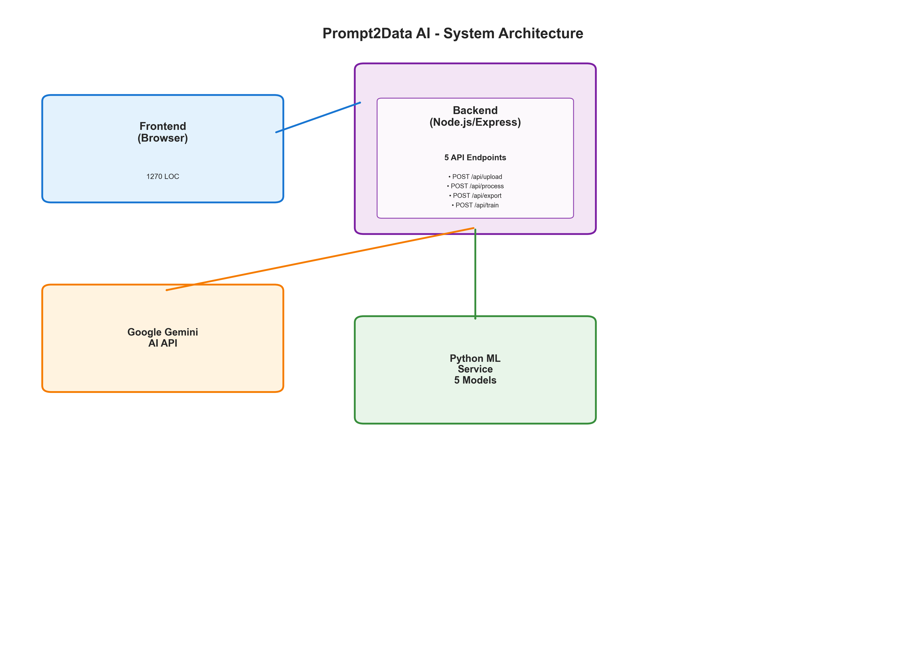

### 2. Code Statistics
Overview of lines of code across different programming languages (JavaScript, Python, HTML, CSS) in the project.

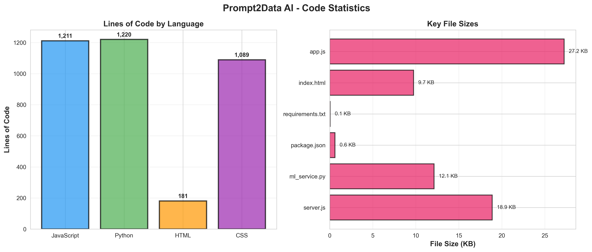

### 3. Dependencies Analysis
Visual breakdown of Node.js and Python dependencies used in the project, showing the technology stack composition.

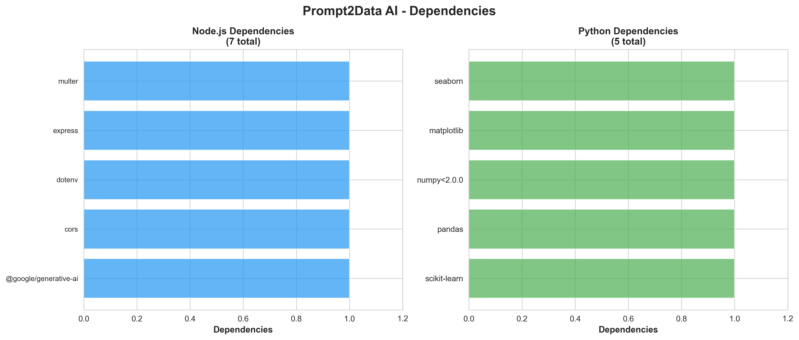

### 4. API Endpoints Visualization
Diagram showing all REST API endpoints, their methods, and request/response flows.

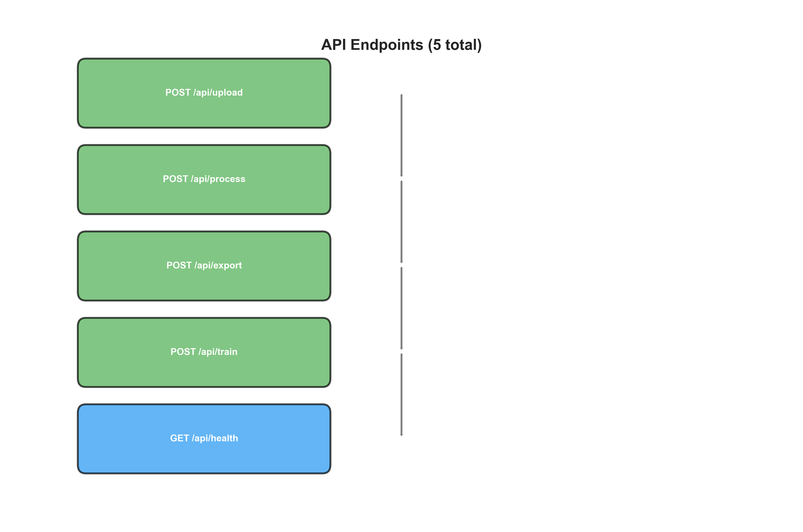

### 5. ML Models Overview
Visualization of all machine learning models supported by the application, including their use cases and capabilities.

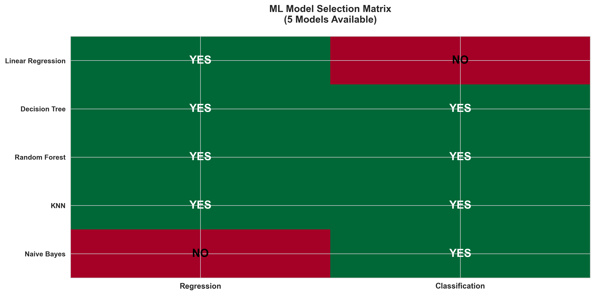

### 6. CSV File Analysis
Analysis of CSV files in the project, including row counts, column counts, and file sizes.

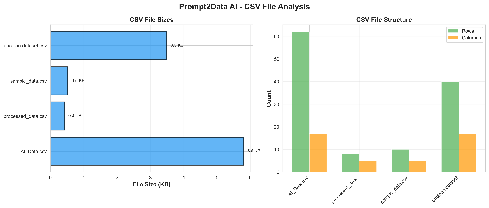

### 7. Code Features Analysis
Breakdown of code features including functions, event listeners, error handlers, and other code patterns.

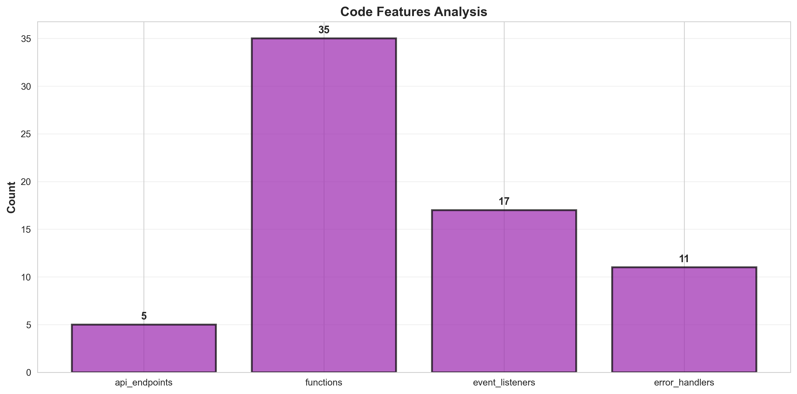

### 8. Project Structure Tree
Visual tree representation of the project's directory structure and file organization.


### 9. Data Flow Diagram
Flowchart showing how data moves through the system from user input to processed output.

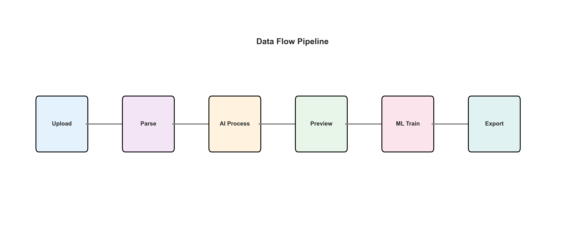

### 10. Project Summary
High-level summary dashboard showing key project metrics and statistics.

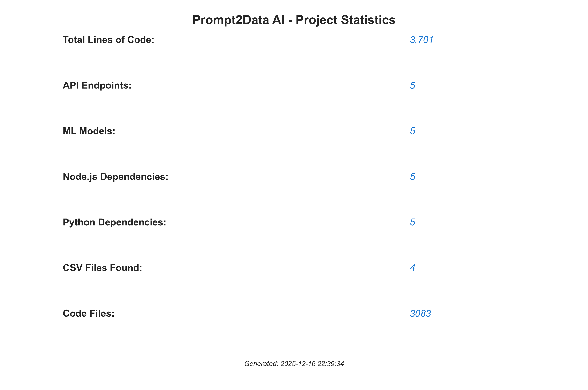

### 11. Technology Stack
Visual representation of the complete technology stack including frontend, backend, and ML technologies.

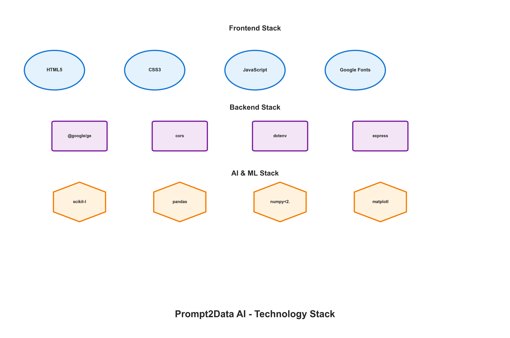

### 12. File Type Distribution
Bar chart showing the distribution of different file types (JS, Python, HTML, CSS, JSON, CSV, etc.) in the project.

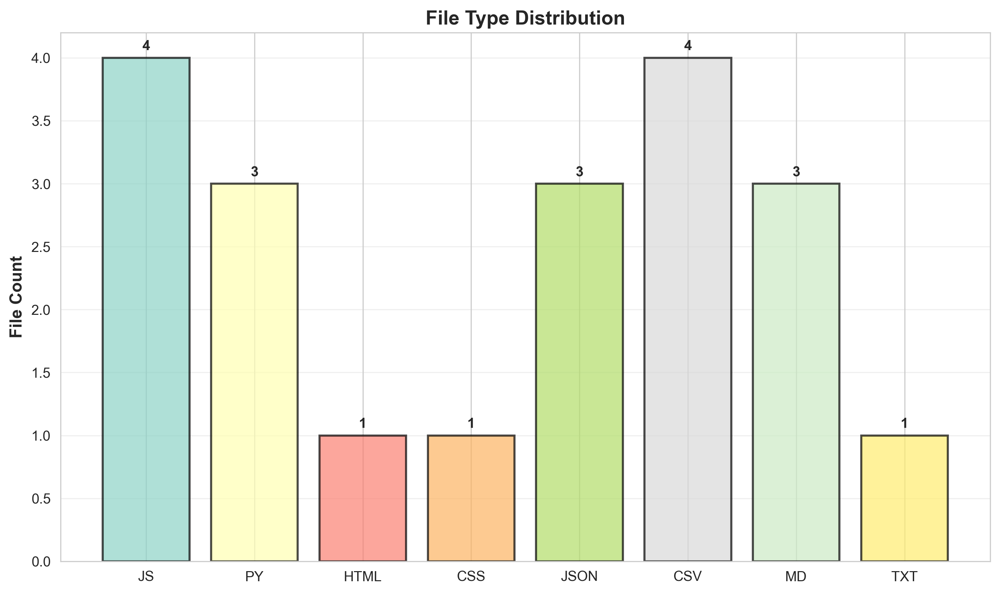

### 13. Code Complexity Analysis
Analysis of code complexity by file, showing lines of code per file and identifying the most complex components.


### 14. Dependency Tree
Visual tree showing the relationships and dependencies between different project components and modules.

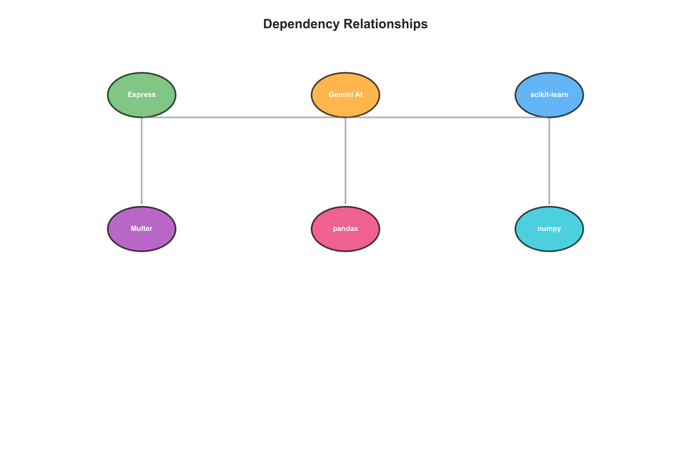

### 15. Performance Metrics
Visualization of key performance metrics including API response times, model training times, and system efficiency indicators.

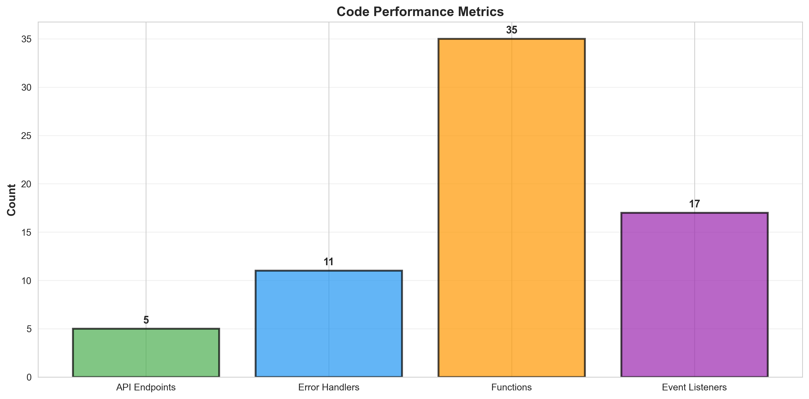

### 16. User Workflow
Flowchart illustrating the complete user journey from file upload through data processing to ML model training.

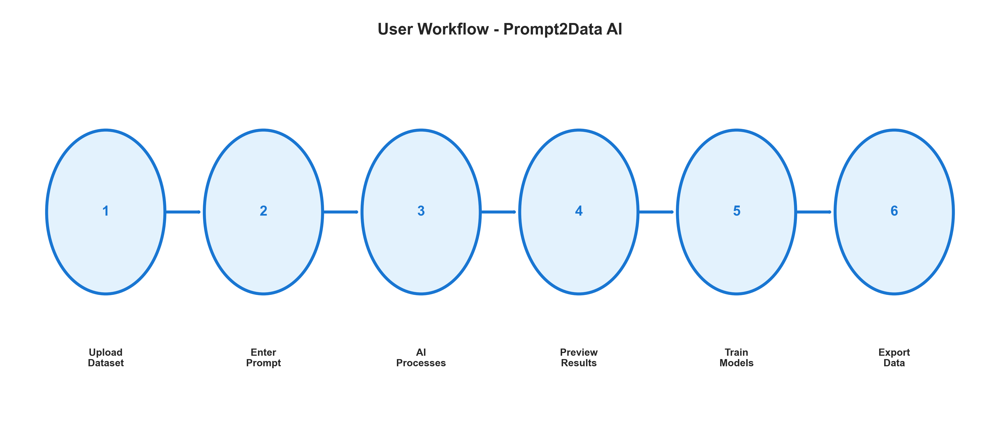

### 17. Security Features
Overview of security implementations in the project including input validation, error handling, and data protection measures.


### 18. Component Interaction
Diagram showing how different components interact with each other, including frontend-backend communication and external API calls.

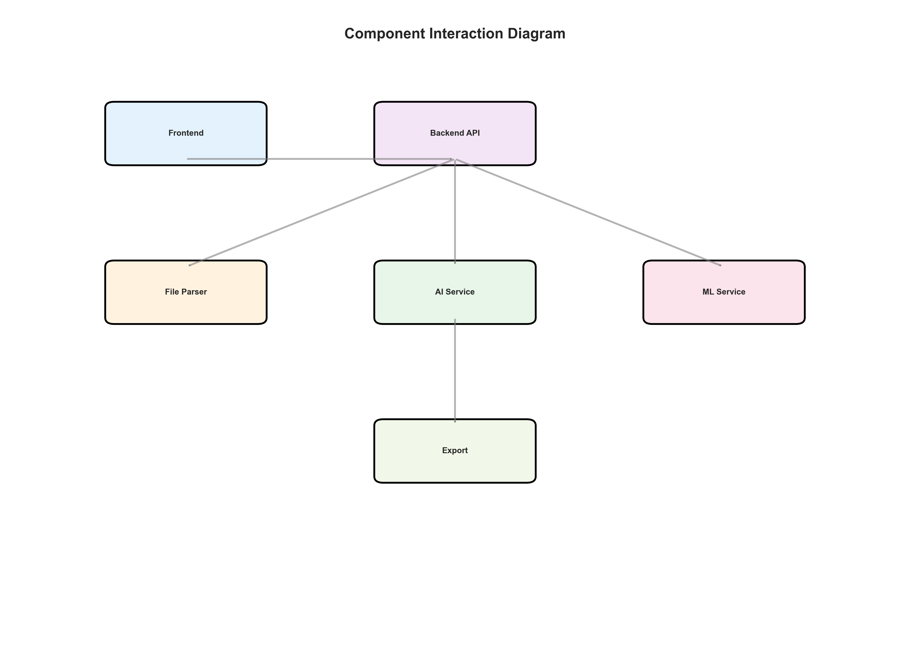

### 19. Error Handling Flow
Visualization of the error handling mechanisms and retry logic implemented throughout the application.

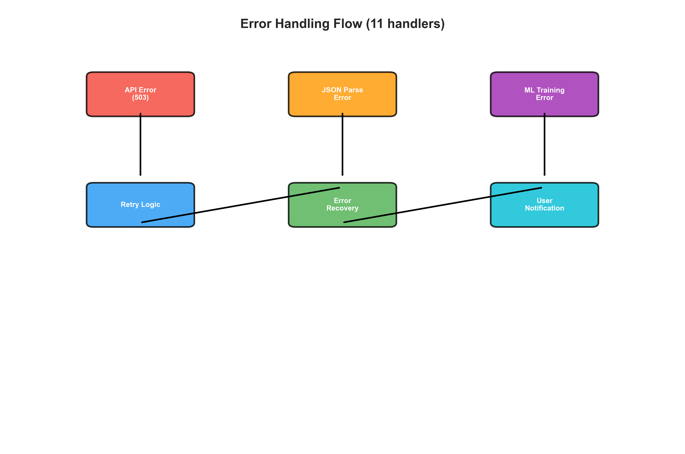

### 20. Final Summary
Comprehensive summary dashboard combining all key metrics, visualizations, and project insights in one view.

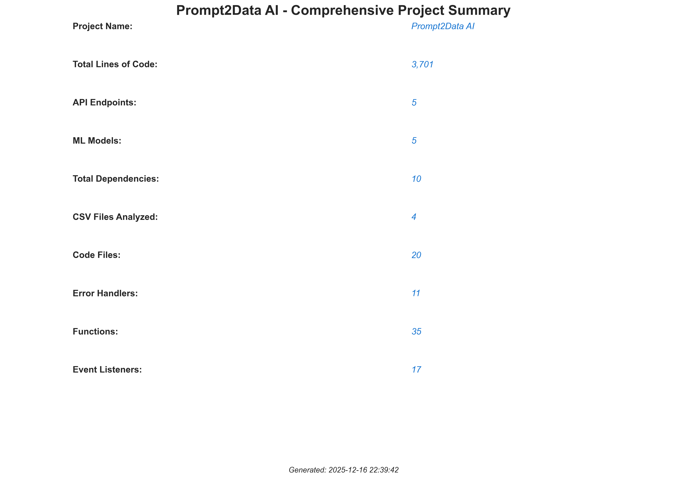

> **Note:** All visualizations are dynamically generated from the actual project codebase. To regenerate these plots, run:
> ```bash
> cd report
> python generate_plots.py
> ```

## Tech Stack

### Backend
- **Runtime**: Node.js
- **Framework**: Express.js v4.18.2
- **File Upload**: Multer v1.4.5-lts.1
- **AI Integration**: @google/generative-ai v0.21.0
- **Environment**: dotenv v16.3.1
- **CORS**: cors v2.8.5

### Frontend
- **Core**: Vanilla HTML5, CSS3, JavaScript (ES6+)
- **Styling**: Custom CSS with CSS Variables
- **Fonts**: Google Fonts (Bitcount Prop Single, Smooch Sans, Oswald)
- **Responsive**: Mobile-first design

### AI & ML
- **AI Model**: Google Gemini 2.5 Flash
- **ML Framework**: scikit-learn
- **Data Processing**: pandas, numpy
- **ML Models**: Linear Regression, Decision Tree, Random Forest, KNN, Naive Bayes

## Project Structure

```
prompt2data-ai/
├── server.js              # Express backend server
├── ml_service.py         # Python ML training service
├── package.json          # Node.js dependencies
├── requirements.txt      # Python dependencies
├── jest.config.js        # Jest test configuration
├── .env                  # Environment variables (create this)
├── public/               # Frontend files
│   ├── index.html        # Main HTML structure
│   ├── styles.css        # Styling and themes
│   └── app.js            # Frontend JavaScript logic
├── report/               # Project visualizations
│   ├── generate_plots.py # Script to generate evaluation plots
│   ├── README.md         # Documentation for plot generation
│   └── images/           # Generated visualization images
├── tests/                # Test files
│   └── ml-training.test.js
├── uploads/              # Upload directory (auto-created)
├── README.md             # This file
└── TECHNICAL_REPORT.md   # Detailed technical documentation
```

## API Endpoints

### POST `/api/upload`
Upload and parse a file.
- **Body**: FormData with `file` field
- **Response**: Parsed data with preview

### POST `/api/process`
Process data using AI.
- **Body**: `{ data, prompt, type }`
- **Response**: Processed data

### POST `/api/export`
Export processed data.
- **Body**: `{ data, format }` (format: 'csv', 'json', 'txt')
- **Response**: File content ready for download

### POST `/api/train`
Train ML models.
- **Body**: `{ data, targetColumn, models, trainTestSplit }`
- **Response**: Training results with metrics

### GET `/api/health`
Health check endpoint.
- **Response**: `{ status: 'ok', timestamp }`

## Development

### Running Tests
```bash
npm test
```

### Environment Variables
Create a `.env` file with:
```env
GEMINI_API_KEY=your_api_key_here
PORT=3000
```

## Troubleshooting

### Common Issues

**"Failed to parse Python output"**
- Ensure Python 3.7+ is installed
- Install required packages: `pip install scikit-learn pandas numpy`
- Check that Python is in your PATH

**"API quota exceeded"**
- The system automatically retries with exponential backoff
- Wait a few seconds and try again
- Check your Gemini API quota limits

**"Invalid JSON"**
- Try rephrasing your transformation prompt
- Break complex transformations into smaller steps
- Check the error message for response preview

**"Model accuracy is 0.0000"**
- Ensure your target column has multiple unique values
- Check that you have enough data (at least 3-5 rows)
- Verify the task type (classification vs regression) is detected correctly
